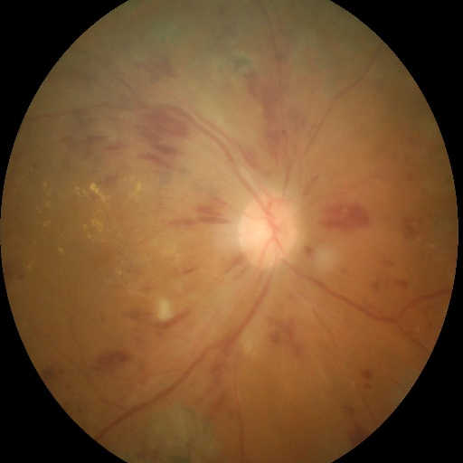
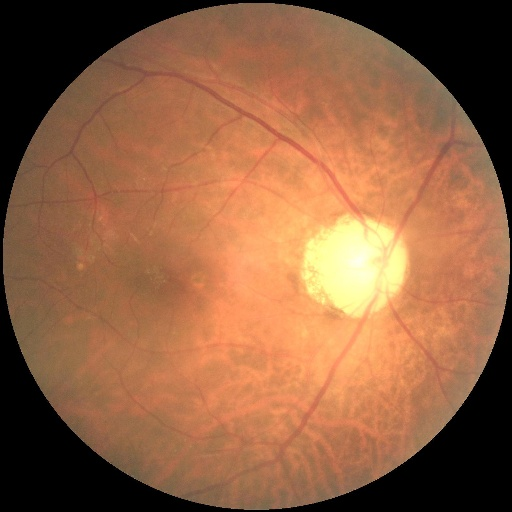
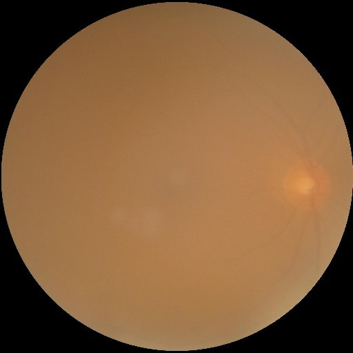
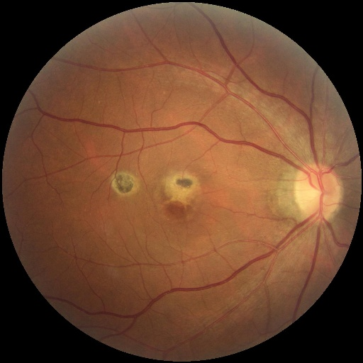
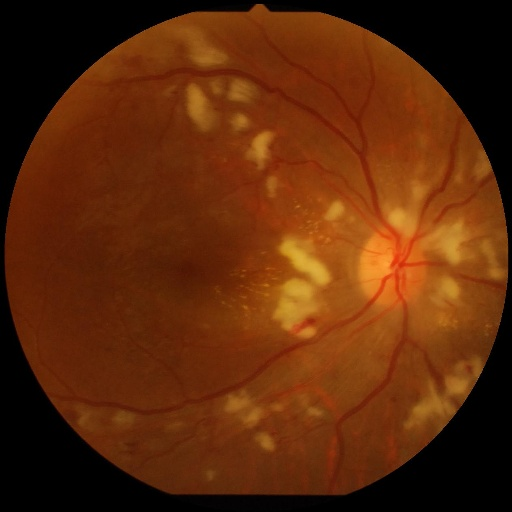
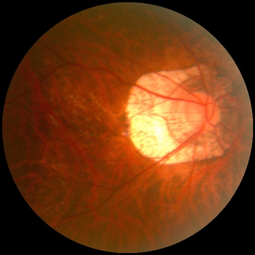
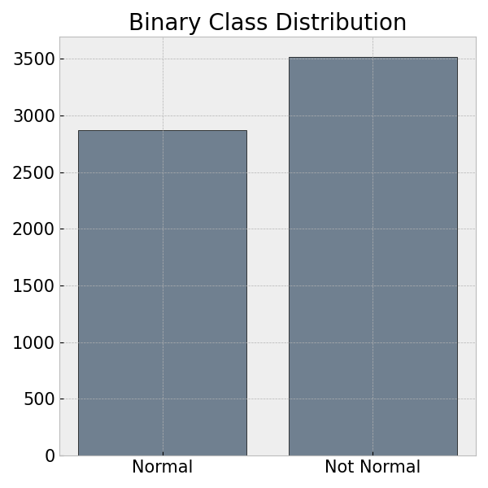
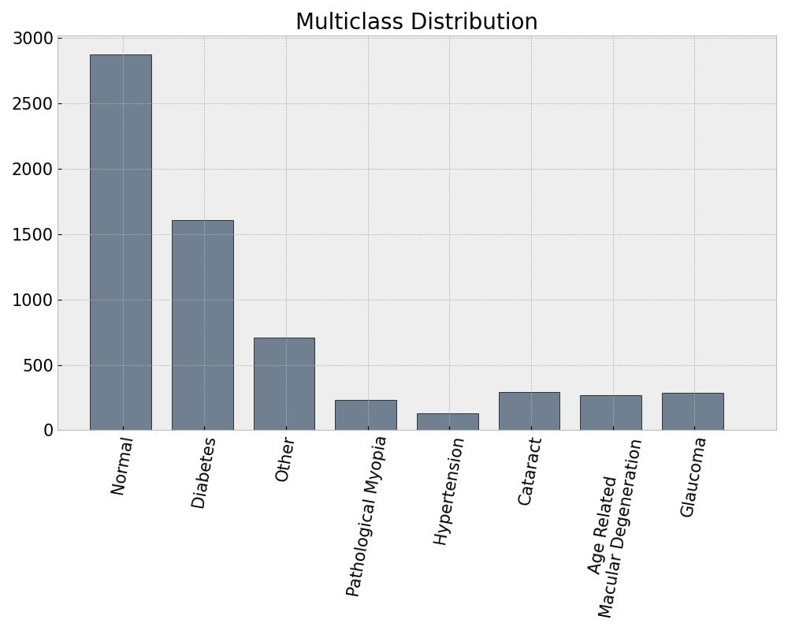
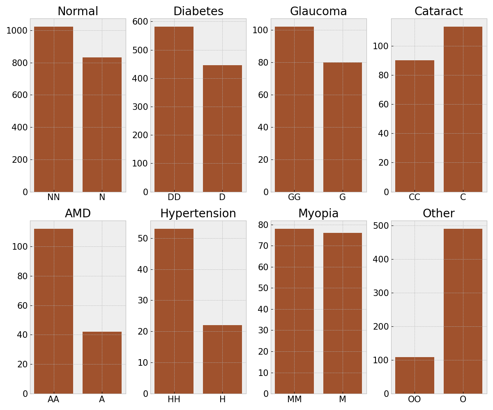
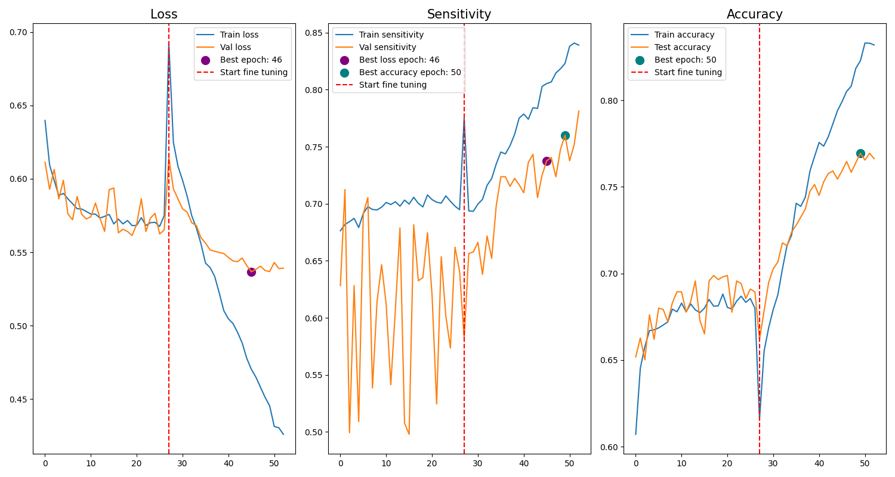

# Retinal Disease Classification
---

Retinal eye diseases, such as diabetic retinopathy, macular degeneration, and glaucoma are some of the leading causes of vision loss worldwide. Early and accurate detection of these conditions is critical to preventing irreversible damage and to initiate treatment. However, traditional diagnostic methods that rely on manual analysis by optometrists or ophthalmologists can be time-consuming, subjective, or inaccessible to underserved populations.

This project aims to develop an image classification model to differentiate a healthy retina from a non-healthy retina. The primary focus is on maximizing sensitivity, as missing a diagnosis could lead to severe consequences for patients, including delayed treatment and potential vision loss. Achieving high sensitivity ensures that cases with potential disease are flagged for further review and additional diagnostic testing methods to minimize the risk of overlooked conditions.

Some challenges include:
* Variability in image quality, caused by different skills in the technician taking the photo, different quality machines, and interfering factors like dust on the imaging lens.
* Differentiating between subtle differences between similar diseases.
* Addressing class imbalance where some diseases are underrepresented.

The goal is to create an additional tool to aid optometrists/ophthalmologists in improving diagnostic accuracy and prioritizing patient health through minimal false negatives. To consider a model production ready I would want accuracy above 80% and sensitivity above 95%. 

All image data and the final saved Keras model for this project are hosted on this [Google Drive](https://drive.google.com/drive/folders/1sbu1XlEluZJrbUmGFn5uPuOlhPmZ2QVV?usp=drive_link) in zip files for those that would like to run through the code themselves.

---
## Introduction
There are several retinal diseases represented in this project:

* ***Diabetes*** - While a systemic condition, it can affect the small blood vessel located in the retina. Severe cases that aren't caught early can require laser surgery to repair and leave permanent vision loss.

 

* ***Glaucoma*** - Characteristically increases pressure inside the eye that stresses the optic nerve. Vision loss from glaucoma starts in a patient's peripheral vision so they are often asymptomatic in the early stages. There are several treatment options to prevent the progression of glaucoma, but any damage caused to the optic nerve is irreversible.

 

* ***Cataract*** - The lens inside the eye grows clowdy and opaque, usually with age, and the impact on vision is gradual. Can be treated with cataract surgery where the lens in taken out and replaced with a lens implant. Cataracts don't affect the retina directly, but they impede the view of the retina to detect other conditions.

 

* ***Age Related Macular Degeneration (AMD)*** - There are two major types, dry and wet. They both affect the macula which directly affects our central vision. Neither kind is curable, but monitoring is key because if dry AMD turns to wet, vision loss can be sudden and severe.

 

* ***Hypertension*** - Another systemic condition that affects our blood vessels. Often asymptomatic until damage is severe, early detection from yearly screenings is crucial to prevent damage to the retina.

 

* ***Pathological Myopia*** - When a patient's vision is short sighted enough that the back of the eye experiences degenerative changes. While untreatable, these retinal changes mean the patient is at higher risk for events like retinal detachments and they may want more frequent retinal monitoring.

 

The annual eye exam is the forefront way to screen for these conditions and many others. The historical method is for an optometrist or ophthalmologist to perform a dilated fundus exam where they dilate the pupil and physically look at the back of the eye. The increasingly preferred method is to take a photo of the retina with a fundus photography camera. They are not available in all practices, but if available they provide the doctor a more detailed look at the retina where they can focus and zoom on areas of interest and they can compare images year to year.

---
## [Image Analysis](./code/01-eda.ipynb)

All data for this project is from Kaggle's [Ocular Disease Recognition Dataset](https://www.kaggle.com/datasets/andrewmvd/ocular-disease-recognition-odir5k). This dataset included right and left eye images for 5,000 patients, as well as these images preprocessed where they were standardized to one image size and images of low quality with no diagnosis were removed. I worked with these preprocessed images. Also included is a .csv with the details shown below for each image.

|Feature|Type|Description|
|---|---|---|
|**ID**|*int*|Unique patient identifier|
|**Patient Age**|*int*|Age of patient|
|**Patient Sex**|*str*|Sex of patient|
|**Left-Fundus**|*str*|Filename for image of left eye for this patient|
|**Right-Fundus**|*str*|Filename for image of right eye for this patient|
|**Left-Diagnostic Keywords**|*str*|Diagnosis words for left eye fundus photo|
|**Right-Diagnostic Keywords**|*str*|Diagnosis words for right eye fundus photo|
|**N**|*int*|Normal fundus photo categorical column|
|**D**|*int*|Diabetes fundus photo categorical column|
|**G**|*int*|Glaucoma fundus photo categorical column|
|**C**|*int*|Cataract fundus photo categorical column|
|**A**|*int*|Age Related Macular Degeneration fundus photo categorical column|
|**H**|*int*|Hypertension fundus photo categorical column|
|**M**|*int*|Pathological Myopia fundus photo categorical column|
|**O**|*int*|Other diseases/abnormalities fundus photo categorical column|
|**filepath**|*str*|Filepath to the image for observation|
|**labels**|*str*|Diagnostic label for observation|
|**target**|*str*|Diagnostic target for observation|
|**filename**|*str*|Filename of image for observation|
|**image files**|*.jpg*|Individual fundus photos|
 

I prepared the data for both a binary classification for health vs. non-healthy retinal images as well as multiclass classification for each individual disease label. Seen below, the distribution for the binary classes was fairly even compared to very imbalanced classes for the multiclass problem.

 

For most of the diseases, patients were split evenly on whether the condition affected both eyes or only one eye. The exceptions to this were AMD and hypertension where the majority of patients showed signs in both eyes. Those patients that have some other condition or abnormality that doesn't fall under the 6 listed conditions predominantly only have it in one eye.

 

### Image Augmentation
To increase the size of the image dataset I investigated several options to transform and augment the data. I considered converting the images to grayscale to try and mimic the autofluorescence settting on some fundus photography machines that highlights different conditions. This didn't have the affect I was looking for so I didn't end up using these photos to train any models. I also cropped images around the optic nerve and macula for the images. I didn't use these for training either, if I continue on to transfer learning for the multiclass problem I might bring them in since some conditions are focused around those areas but since not all images are centered the coordinates for cropping don't include the area of interest for every image. I did end up including all images flipped horizontally because any condition can affect either eye non-discriminantly so this gave the models more data for each eye. In modeling I used two random augmentation methods, rotation to account for slight variations in orientation with images taken and contrast to try and highlight conditions that show up as dark or bright spots.

---
## [Modeling](./code/02_modeling.ipynb)

The next step was to build a model to predict if an image is of a normal retina or a diseased retina. I trained all models using an A100 GPU server on Google Colab to increase training speed. I started with building a Convolutional Neural Network (CNN) from scratch using Keras. I tuned several iterations while trying to build one complex enough to learn from the dataset, however I was unable to get any model to perform above the baseline accuracy of 55% because it was predicting every image as the positive class (not healthy).

At this point I switched to transfer learning using pretrained models ResNet152V2 and Xception with Keras. I tried ResNet152V2 first and after tuning it achieved a validation accuracy of 70.67% and a validation sensitivity of 70.97%. This was no where close to what I need for a production model so I then tried transfer learning with Xception. After tuning this model my final validation accuracy was 75.92% and validation sensitivity was 73.77%. Below you can see the training path for this Xception trained model showing loss, sensitivity and accuracy.

 

This model doesn't reach my benchmark to make it production ready. I would need to tune at what level the pretrained level is trainable, and it starts overfitting as soon as it starts learning from the new data so I would need to introduce more regularization within the network. With the model for binary classification not reaching the level I needed for production I didn't pursue the multiclass problem. 

---
## Insights and Next Steps

The final tuned Xception model achieved a validation accuracy of 75.92% and a test accuracy of 74.77%. However, these metrics fall short of the production-ready threshold of 90% accuracy. While the model demonstrates some discriminatory power by improving over the baseline accuracy of 55%, the test set sensitivity of 74.02% is concerning, as the production-ready threshold of 95% sensitivity is critical for minimizing false negatives in retinal disease detection.

Some possible next steps:
* Utilize additional data augmentation techniques.
* Experiment with other pretrained architectures, I only looked at two in this project.
* Start fine tuning layers deeper in Xception to adapt to the the specific dataset better, and try other regularization techniques with this to prevent overfitting.
* Tune hyperparameters such as learning rate and optimizers to help mitigate overfitting.
* Explore other preprocessing techniques to highlight regions specific to fundus images.
* Try combining multiple pretrained models.

If production-level performance is able to be reached for the binary classification using further tuning and additional techniques, only then would I utilize transfer learning and build a multiclass model to predict the specific disease classes. 
